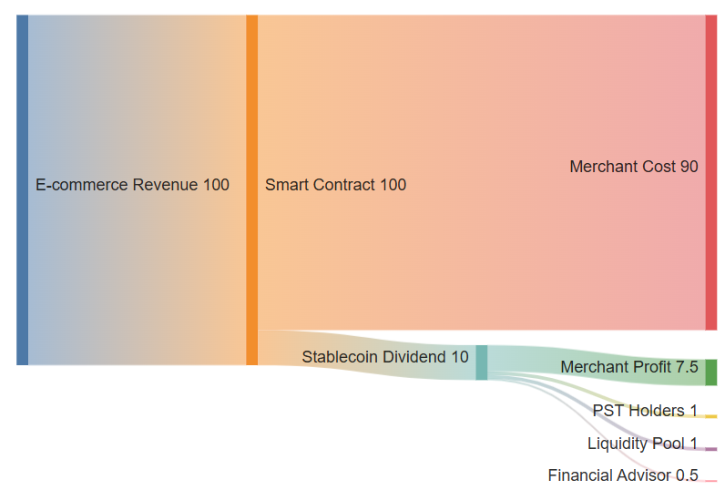

# CEX - Binance, OKX, Coinbase

This guide is for you if:

* You don't own a cold wallet, and you think storing seed phrase is too much hassle
* You own a CEX account such as Binance, OKX, Coinbase

## 1. Create an account

Nobody likes storing seed phrases, click "Connect Wallet" in [liquidroyalty.com](https://liquidroyalty.com), and select one of the options to create an account - these options allow you to create an account just with email / X / github etc.

<figure><figcaption></figcaption></figure>

## 2. Withdraw USDC from CEX to your connected account

All top CEXs support USDC, withdraw USDC from any CEX to your account created in Step 1

<figure><figcaption></figcaption></figure>

Any of the chains below will allow you to swap to royalty tokens easily:

* Base
* Ethereum
* Arbitrum
* Polygon
* Berachain

Depends on the choice of chain, you can now buy Royalty Tokens by following one of the guides:

For Base | Ethereum | Arbitrum | Polygon


[base-or-ethereum-or-arbitrum-or-polygon.md](base-or-ethereum-or-arbitrum-or-polygon.md)


For Berachain


[berachain-native.md](berachain-native.md)


